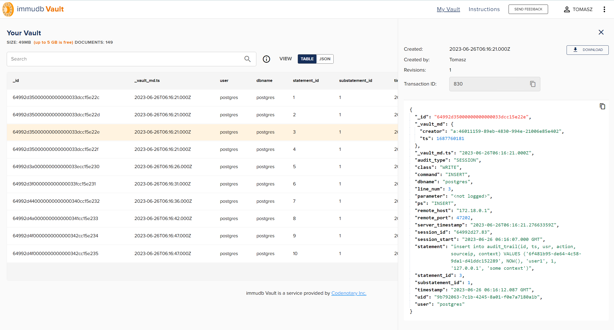

# Log auditing secured by immudb

vault-log-audit is a simple service and cli tool to store json formatted log input and audit it later in [immudb Vault](https://vault.immudb.io). 

Note: the previous version using directly immudb is deprecated, nevertheless can still be used. More instructions can be found [here](./doc/immudb-log-audit.md)

Example json input log source

```json
{"field1":1, "field2":"abc", "field3": "2023-03-10T22:38:26.461908Z", "group": {"field4":"cde"}}
{"field1":2, "field2":"cde", "field3": "2023-03-10T22:38:26.461908Z", "group": {"field4":"cde"}}
{"field1":3, "field2":"efg", "field3": "2023-04-10T22:38:26.461908Z", "group": {"field4":"cde"}}
{"field1":4, "field2":"ijk", "field3": "2023-05-10T22:38:26.461908Z", "group": {"field4":"cde"}}
```

In addition, vault-log-audit provides few predefined log line parsers, which make it easier to configure Vault and push data:
- pgauditjsonlog, which configures Vault with predefined set of indexes and stores them in Vault (recommended).
- pgaudit, which transforms pgaudit audit std logs into json representation and stores them in Vault. 
- wrap, which accepts any log line and wraps it into json adding uid and timestamp and stores them in Vault.
- default, no parsing or predefined Vault configuration, everything is up to the user. 


## Installation

### Building from source

To build vault-log-audit binary, clone this repository and run

```bash
make
```

### Docker image

The simplest way is to pull image from [docker hub](https://hub.docker.com/r/codenotary/vault-log-audit)

```bash
docker pull codenotary/vault-log-audit
```

To build vault-log-audit docker image locally, clone this repository and run

```bash
make docker
```

## Overview
vault-log-audit uses [immudb Vault](https://vault.immudb.io) to store your log data. In general, it allows for easy parsing of any log file, including not JSON, and store its content securely in Vault.  

### Vault connection
To send data, you need to configure immudb Vault api key:

```bash
export VAULT_API_KEY=<your api key>
```

### Storing data
To start storing data, you need to first [create a collection and define indexes](https://vault.immudb.io/docs/guide/immudb-vault/immudb_vault_API_technical#create-a-vault), or use one of available line parsers that have them predefined.

To create a custom Vault:

```bash
./vault-log-audit create --indexes '{"fields":[ {"name":"field1", "type": "INTEGER" } ], "indexes":[ { "fields": [ "field1" ] } ]}'
```

After creating a collection, data can be easily pushed using tail subcommand. Currently supported sources are file and docker container. Both can be used with --follow option, which in case of files will also handle rotation and automatically track monitored files to minimize possibility of logs duplication. 

```bash
./vault-log-audit tail file path/to/your/file --follow
```

```bash
./vault-log-audit tail docker container_name --follow --stdout --stderr
```

Note: adding --log-level trace will print what lines have been parsed and stored

### Reading data
Best way to view your data is to login to [immudb Vault](https://vault.immudb.io).


Nevertheless, reading data from immudb Vault can be done also from command line:

```bash
./vault-log-audit read 
```

If you need to query based on [Vault indexes](https://vault.immudb.io/docs/guide/immudb-vault/immudb_vault_API_technical#search-documents)

```bash
./vault-log-audit read '{ "expressions": [ {"fieldComparisons": [ {"field": "field1", "operator": "EQ", "value": 1 } ] } ] }'
```

### Auditing data
Auditing data from immudb Vault is based on document _id

```bash
./vault-log-audit audit 6498b5d40000000000000337cc15e225
```

## Storing pgaudit logs in immudb
[pgaudit](https://github.com/pgaudit/pgaudit) is PostgreSQL extension that enables audit logs for the database. Any kind of audit logs should be stored in secure location. immudb is fullfiling this requirement with its immutable and tamper proof features.

vault-log-audit can parse PostgreSQL pgaudit logs in following formats: 

- Jsonlog log parser (recommended)
- Stderr log parser. It assumes that each log line has log_line_prefix of '%m [%p] '.

For more information about those formats, visit [PostgreSQL logging documentation](https://www.postgresql.org/docs/current/runtime-config-logging.html).

To start, you need to have an PostgreSQL running with pgaudit extension enabled. As the example, [bitnami postgresql](https://hub.docker.com/r/bitnami/postgresql) which already hase pgaudi extension can be used. 



### Pull postgres image

```bash
docker pull docker.io/bitnami/postgresql:15
```

### jsonlog log format

The example pgaudit jsonlog log line looks like:
```json
{"timestamp":"2023-05-13 21:09:08.502 GMT","user":"postgres","dbname":"postgres","pid":138,"remote_host":"172.22.0.1","remote_port":58300,"session_id":"645ffc74.8a","line_num":1,"ps":"CREATE TABLE","session_start":"2023-05-13 21:09:08 GMT","vxid":"3/44","txid":736,"error_severity":"LOG","message":"AUDIT: SESSION,1,1,DDL,CREATE TABLE,,,\"create table if not exists audit_trail (id VARCHAR, ts TIMESTAMP, usr VARCHAR, action INTEGER, sourceip VARCHAR, context VARCHAR, PRIMARY KEY(id));\",<not logged>","backend_type":"client backend","query_id":0}
```

pgauditjsonlog parser will convert each jsonlog log line into following json

```json
{"audit_type":"SESSION","statement_id":1,"substatement_id":1,"class":"DDL","command":"CREATE TABLE","statement":"create table if not exists audit_trail (id VARCHAR, ts TIMESTAMP, usr VARCHAR, action INTEGER, sourceip VARCHAR, context VARCHAR, PRIMARY KEY(id));","parameter":"\u003cnot logged\u003e","uid":"f233afdd-304b-44e8-90ee-a7757b46c49f","server_timestamp":"2023-05-13T22:35:07.666574128Z","timestamp":"2023-05-13 21:09:08.502 GMT","user":"postgres","dbname":"postgres","remote_host":"172.22.0.1","remote_port":58300,"session_id":"645ffc74.8a","line_num":1,"ps":"CREATE TABLE","session_start":"2023-05-13 21:09:08.000 GMT"}
```

The indexed fields for pgauditjsonlog are
```
uid, user, dbname, session_id, statement_id, substatement_id, server_timestamp, timestamp, audit_type, class, command
```

### stderr log format

The example pgaudit stderr log line looks like:

```
2023-02-03 21:15:01.851 GMT [294] LOG:  AUDIT: SESSION,61,1,WRITE,INSERT,,,"insert into audit_trail(id, ts, usr, action, sourceip, context) VALUES ('134ff2d5-2db4-44d2-9f67-9c7f5ed64967', NOW(), 'user60', 1, '127.0.0.1', 'some context')",<not logged>
```

pgaudit parser will convert each stderr log line into following json

```json
{"uid": "234aa2d5-2db4-44d2-9f67-9c7f5eda4967", "timestamp":"2023-03-16T08:58:44.033611299Z","log_timestamp":"2023-03-02T21:15:01.851Z","audit_type":"SESSION","statement_id":61,"substatement_id":1,"class":"WRITE","command":"INSERT","statement":"insert into audit_trail(id, ts, usr, action, sourceip, context) VALUES ('134ff2d5-2db4-44d2-9f67-9c7f5ed64967', NOW(), 'user60', 1, '127.0.0.1', 'some context')","parameter":"\u003cnot logged\u003e"}
```

The indexed fields for stderr are
```
uid, statement_id, substatement_id, server_timestamp, timestamp, audit_type, class, command
```

### How to set up

You can use [docker-compose end-to-end example](./examples/vault/pgaudit) from this repository.
Before starting compose, configure your API key there.

```bash
docker-compose -f examples/vault/pgaudit/docker-compose.yml up
```

Note: you can execute ```go run test/pgaudit/utils/psql.go``` to generate audit entries.

To manually create vault-log-audit collection for pgaudit logs

```bash
# jsonlog log format
./vault-log-audit create --parser pgauditjsonlog

# or stderr log format
./vault-log-audit create --parser pgaudit
```

Tail PostgreSQL docker container logs

```bash
# jsonlog log format
./vault-log-audit tail docker psql-postgresql-1 --parser pgauditjsonlog --stdout --stderr --follow

# or stderr log format
./vault-log-audit tail docker psql-postgresql-1 --parser pgaudit --stdout --stderr --follow
```

Optionally, adding --log-level trace will print out all lines parsed and stored. 

Read

```bash
./vault-log-audit read 
./vault-log-audit read '{ "expressions": [ {"fieldComparisons": [ {"field": "command", "operator": "EQ", "value": "INSERT" } ] } ] }' 
```

Audit

```bash
./vault-log-audit audit 6498b5d40000000000000337cc15e225
```

## Storing kubernetes audit logs in immudb Vault
Kubernetes allow audit logging showing the track of actions taken in the cluster. To enable kubernets audit, follow the [documentation](https://kubernetes.io/docs/tasks/debug/debug-cluster/audit/).

Kubernetes audit logs are stored as Json structured log, so can be easily parsed and stored in immudb with vault-log-audit. For this exercise, you can use example [k8s.log](test/k8s/k8s.log) from this repository.

Sample json log line

```json
{"kind":"Event","apiVersion":"audit.k8s.io/v1","level":"Metadata","auditID":"d4652481-193e-42f6-9b78-f8651cab5dfe","stage":"RequestReceived","requestURI":"/api?timeout=32s","verb":"get","user":{"username":"admin","uid":"admin","groups":["system:masters","system:authenticated"]},"sourceIPs":["127.0.0.1"],"userAgent":"kubectl/v1.25.6 (linux/amd64) kubernetes/ff2c119","requestReceivedTimestamp":"2023-03-10T22:38:26.382098Z","stageTimestamp":"2023-03-10T22:38:26.382098Z"}
```

### How to set up

First, create k8saudit vault.

```bash
./vault-log-audit create  --indexes '{"fields":[ {"name":"verb", "type": "STRING" }, {"name":"stage", "type": "STRING" }, {"kind":"stage", "type": "STRING" }, {"name":"user.username", "type": "STRING" } ], "indexes":[ { "fields": [ "verb", "stage", "user.username" ] } ]}'
```

Tail k8s.log 

```bash
./vault-log-audit tail file test/k8s/k8s.log --follow
```

Read

```bash
./vault-log-audit read 
./vault-log-audit read '{ "expressions": [ {"fieldComparisons": [ {"field": "user.username", "operator": "EQ", "value": "admin" } ] } ] }' 

```

Audit

```bash
./vault-log-audit audit 6498b5d40000000000000337cc15e225
```

## Storing unstructured logs in immudb
vault-log-audit provides "wrap" parser, which wraps any log line with autogenerated uid and timestamp. In this example, given following syslog line:

```bash
Jan  6 13:57:19 DESKTOP-BLRRBQO kernel: [    0.000000] Hyper-V: privilege flags low 0xae7f, high 0x3b8030, hints 0xc2c, misc 0xe0bed7b2
```

It will convert it to:
```json
{"uid":"6326acda-e254-481f-b030-0144141df091","log_timestamp":"2023-03-16T10:23:25.554276817+01:00","message":"Jan  6 13:57:19 DESKTOP-BLRRBQO kernel: [    0.000000] Hyper-V: privilege flags low 0xae7f, high 0x3b8030, hints 0xc2c, misc 0xe0bed7b2"}
```

### How to set up
[Syslog file](test/syslog/syslog) is used as an example, but source can be any file our log output from a docker container.

First, create syslog collection with "wrap" parser.

```bash
./vault-log-audit create --parser wrap
```

Tail syslog 

```bash
./vault-log-audit tail file test/syslog/syslog
```

Read

```bash
 ./vault-log-audit read
```

Audit

```bash
./vault-log-audit audit 6498b5d40000000000000337cc15e225
```

## Further ideas to develop
Sources:
 - equivalent of kubectl logs
 - syslog server
 - ubuntu/rhel login tracking, auth.log

Deployment:
 - add dockerfile 

Parsers:
 - apache access logs
 - traefik/nginx logs
 - mariadb audit https://mariadb.com/kb/en/mariadb-audit-plugin/
 - ubuntu/rhel auth.log parser 
 - templating/pattern matching for unstructured logs 

Others:
 - OpenPolicyAgent logs ?

